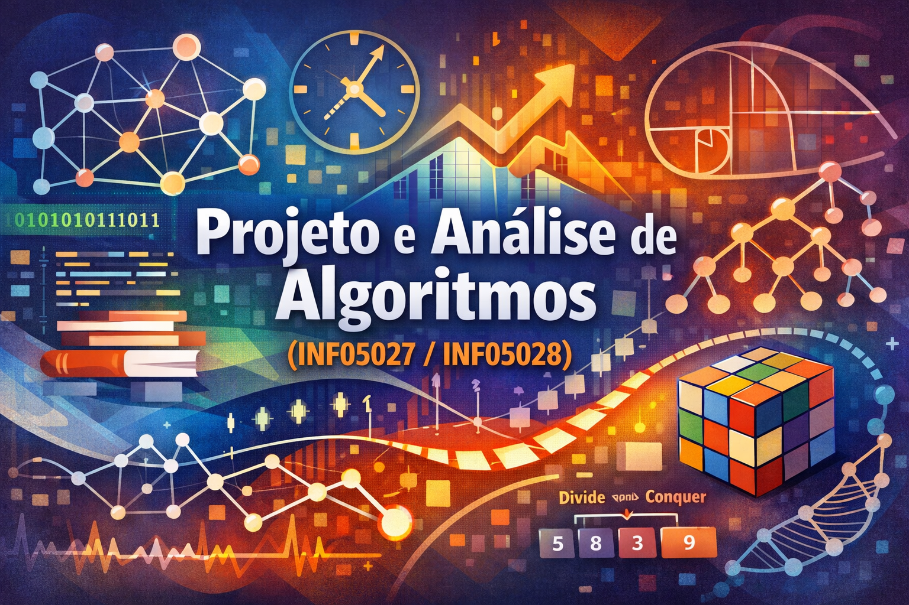

# Projeto e Análise de Algoritmos (INF05027/INF05028)

Repositório de códigos e exemplos para as disciplinas **INF05027 – Projeto e Análise de Algoritmos I** e **INF05028 – Projeto e Análise de Algoritmos II** do Instituto de Informática da UFRGS. O objetivo é concentrar implementações didáticas, exercícios e variações de algoritmos vistos em aula, facilitando o uso por diferentes alunos e professores ao longo do tempo.

As descrições de escopo abaixo foram extraídas das súmulas e conteúdos dos planos de ensino:
- PAA I: [`PlanodeEnsinoPAA1.pdf`](PlanodeEnsinoPAA1.pdf)
- PAA II: [`PlanodeEnsinoPAA2.pdf`](PlanodeEnsinoPAA2.pdf)

**Como ler o catálogo**
- Arquivos de um mesmo algoritmo são listados juntos.
- Cada entrada informa linguagem, autoria e uma frase de descrição.

## Projeto e Análise de Algoritmos I (INF05027)

**Escopo:** análise e corretude de algoritmos, notação assintótica, teoria dos grafos, algoritmos e estruturas de dados para grafos e algoritmos gulosos.

**Introdução**
| Algoritmo/Estrutura | Arquivos | Linguagem | Autor | Descrição |
| --- | --- | --- | --- | --- |
| Cashier's Algorithm | [https://github.com/BrunoGrisci/cashiers_algorithm_game/tree/main?tab=readme-ov-file](https://github.com/BrunoGrisci/cashiers_algorithm_game/tree/main?tab=readme-ov-file) | JavaScript | Bruno Iochins Grisci | Jogo educacional web para praticar e ensinar o problema de troco por meio de cenários interativos.|
| Gale–Shapley (emparelhamento estável) | [`galeshapley.py`](paa1/galeshapley.py) | Python | Bruno Iochins Grisci | Resolve o problema de emparelhamento estável e inclui exemplos e análise empírica. |
| Quicksort | [`quicksort.rkt`](paa1/quicksort.rkt) | Racket | Bruno Iochins Grisci | Ordena vetores de números de forma recursiva. |
| Exemplos diversos com custo | [`exemplos_custo.rkt`](paa1/exemplos_custo.rkt) | Racket | Bruno Iochins Grisci | Exemplos diversos recursivos para análise de custo. |

**Algoritmos para grafos**
| Algoritmo | Arquivos | Linguagem | Autor | Descrição |
| --- | --- | --- | --- | --- |
| Em construção | — | — | — | Seção reservada para algoritmos gerais de grafos. |

**Algoritmos gulosos**
| Algoritmo | Arquivos | Linguagem | Autor | Descrição |
| --- | --- | --- | --- | --- |
| Dijkstra (caminhos mínimos) | [`naivedijkstra.py`](paa1/naivedijkstra.py) | Python | Bruno Iochins Grisci | Calcula distâncias mínimas em grafos com pesos positivos (versão simples). |
| Dijkstra (caminhos mínimos) | [`heapdijkstra.py`](paa1/heapdijkstra.py) | Python | Bruno Iochins Grisci | Calcula distâncias mínimas em grafos com pesos positivos (versão com heap). |
| Heap mínimo (min-heap) | [`heap_demo.py`](paa1/heap_demo.py) | Python | Bruno Iochins Grisci | Demonstra operações de heap mínimo com visualização e rastreio didático. Observação: há um repositório dedicado em [https://github.com/BrunoGrisci/heap-demo](https://github.com/BrunoGrisci/heap-demo). |

**Teoria dos grafos**
| Algoritmo | Arquivos | Linguagem | Autor | Descrição |
| --- | --- | --- | --- | --- |
| Hierholzer (caminho euleriano) | [`hierholzer.py`](paa1/hierholzer.py) | Python | Bruno Iochins Grisci | Encontra um caminho euleriano em grafo direcionado usando pilha explícita. |
| Welsh–Powell (coloração gulosa) | [`welsh_powell.py`](paa1/welsh_powell.py) | Python | Bruno Iochins Grisci | Colore vértices de um grafo usando ordenação por grau e estratégia gulosa. |

## Projeto e Análise de Algoritmos II (INF05028)

**Escopo:** divisão e conquista, programação dinâmica, técnicas avançadas de projeto e estruturas de dados avançadas.

**Divisão e Conquista**
| Algoritmo | Arquivos | Linguagem | Autor | Descrição |
| --- | --- | --- | --- | --- |
| Contagem de Inversões | [`inversions.cpp`](paa2/inversions.cpp) | C++ | Lucas Nunes Alegre | Implementa o algoritmo de contagem de inversões em um array usando Divisão e Conquista. |
| Par Mais Próximo (2D) | [`closest_pair.cpp`](paa2/closest_pair.cpp) | C++ | Lucas Nunes Alegre | Implementa o algoritmo de Par Mais Próximo em 2D usando abordagem de Divisão e Conquista. |

**Programação Dinâmica**
| Algoritmo | Arquivos | Linguagem | Autor | Descrição |
| --- | --- | --- | --- | --- |
| Edit Distance (Damerau-Levenshtein) | [`edit_distance.py`](paa2/edit_distance.py) | Python | Lucas Nunes Alegre | Implementa o algoritmo de distância de edição de Damerau-Levenshtein. |
| Bellman-Ford (caminhos mínimos) | [`bellman_ford.cpp`](paa2/bellman_ford.cpp) | C++ | Lucas Nunes Alegre | Implementa o algoritmo de Bellman-Ford para encontrar caminhos mínimos em grafos com arestas de peso negativo. |

**Tópicos Avançados**
| Algoritmo | Arquivos | Linguagem | Autor | Descrição |
| --- | --- | --- | --- | --- |
| Em construção | — | — | — | Implementações previstas para esta subárea. |

## Licença

Este repositório é licenciado conforme o arquivo [`LICENSE`](LICENSE).

## Institucional

- Instituto de Informática (UFRGS): [https://www.inf.ufrgs.br](https://www.inf.ufrgs.br)
- Universidade Federal do Rio Grande do Sul (UFRGS): [https://www.ufrgs.br](https://www.ufrgs.br)

## Créditos e Contato Docente

- Prof. Bruno Iochins Grisci: [https://brunogrisci.github.io/](https://brunogrisci.github.io/)
- Prof. Lucas Nunes Alegre: [https://lucasalegre.github.io/](https://lucasalegre.github.io/)

## Veja também
- [GitHub da disciplina de Fundamentos de Algoritmos](https://github.com/BrunoGrisci/fundamentos-de-algoritmos-racket.git)